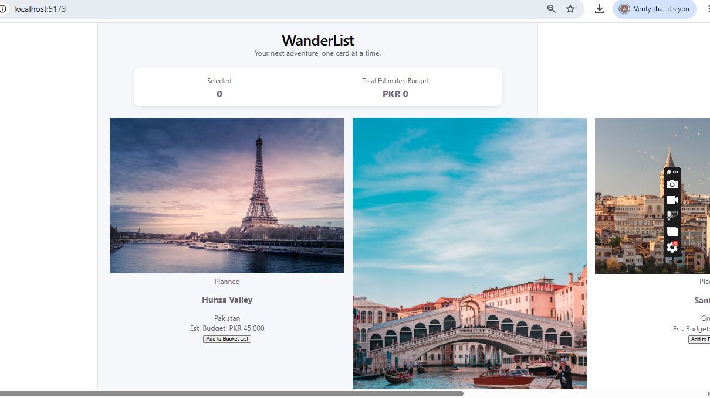
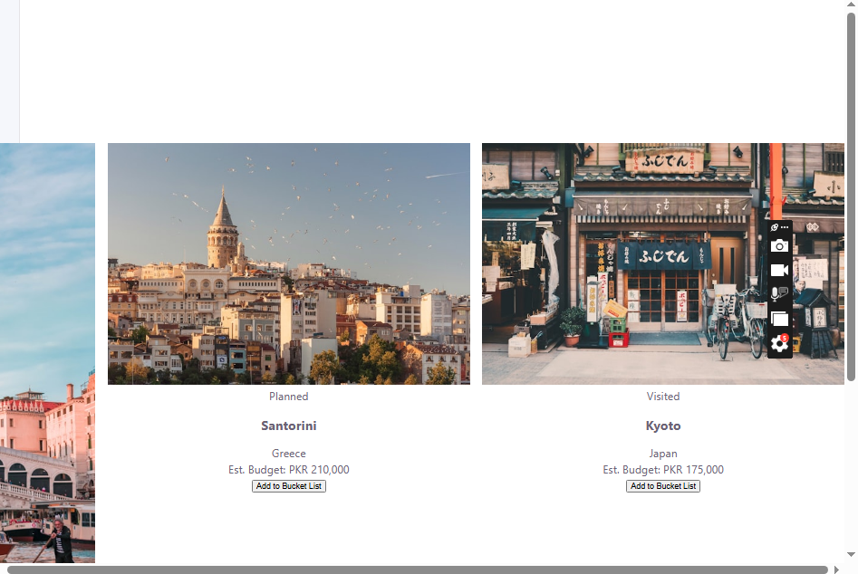
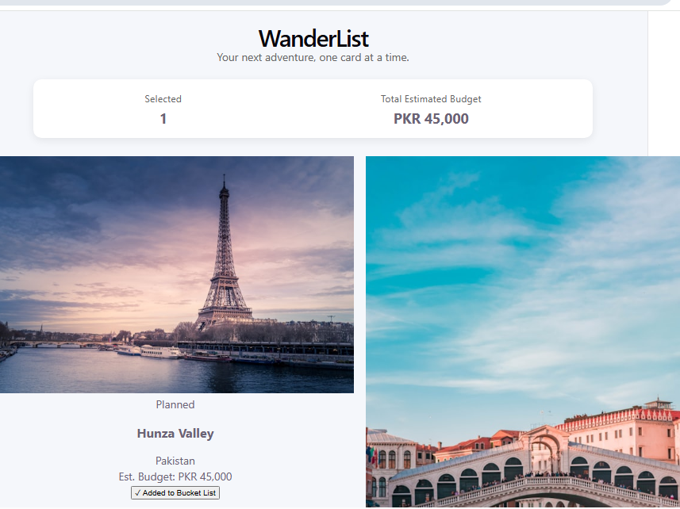

WanderList – Trip Budget Widget

Project Description

WanderList is a React-based travel planning application that allows users to explore destinations and add them to their bucket list.

For Day 23, the application was enhanced with React's "useState" Hook to manage selected destinations and dynamically calculate the total estimated travel budget. The Trip Budget Widget also displays a live count of selected destinations.

Technologies Used

- React.js
- JavaScript
- HTML
- CSS
- React "useState" Hook

Features

- Displays travel destinations with images and estimated budgets.
- Allows users to add destinations to their bucket list.
- Allows users to remove destinations from their bucket list.
- Displays a live count of selected destinations.
- Automatically calculates the total estimated travel budget.
- Updates the budget and destination count instantly when the selection changes.
- Responsive layout for desktop, tablet, and mobile devices.
- Displays destination status such as Planned or Visited.
- Shows travel notes when interacting with destination cards.

State Management

The application uses the React "useState" Hook to manage the selected destination IDs.

When a destination is added or removed from the bucket list, the selected destination count and total estimated budget are recalculated automatically and displayed in the Trip Budget Widget.

## Screenshots

### Destination Cards

### WanderList Output

### Add to Bucket List

Project Outcome

The Day 23 task demonstrates practical use of React state management with "useState". The Trip Budget Widget updates in real time based on the destinations selected by the user, keeping the destination count and estimated budget synchronized with user interactions.