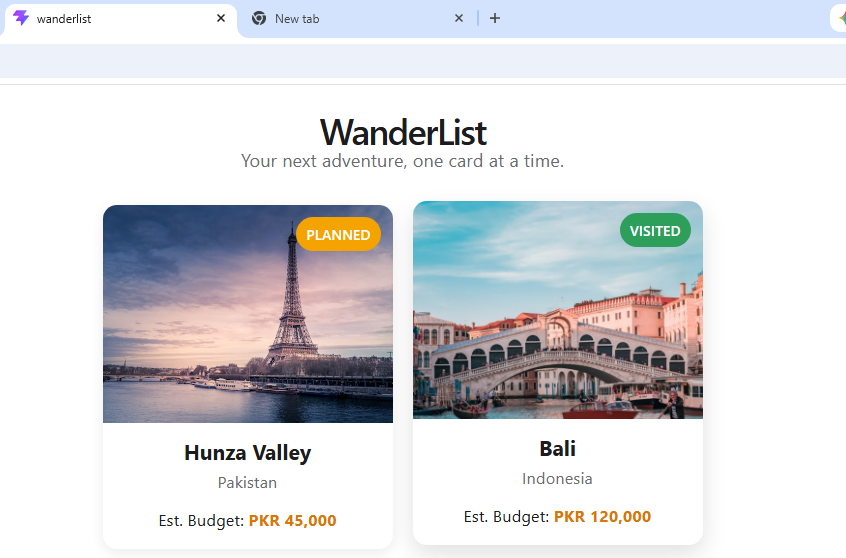
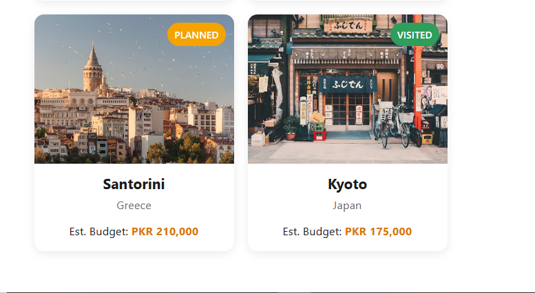

# WanderList — Day 21: React Components

Reusable `DestinationCard` component built for the Frontend Development Internship, Week 4 / Day 21 task.

## What this does
- `DestinationCard` is a presentational component that takes `image`, `place`, `country`, `budget`, and `status` as props.
- `src/data/destinations.js` holds an array of destination objects.
- `App.jsx` maps over the array with `.map()` and renders one `DestinationCard` per entry — no duplicated markup.
- Each card shows a "Planned" or "Visited" badge and is responsive via CSS grid.

## Project structure

wanderlist/
  src/
    components/
      DestinationCard.jsx
      DestinationCard.css
    data/
      destinations.js
    App.jsx
    App.css
    main.jsx
  README.md

## Run locally

npm install
npm run dev

## Screenshots

