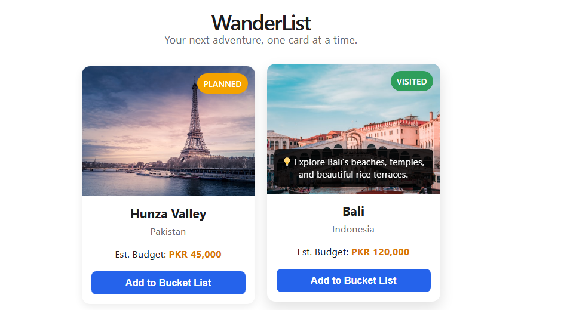
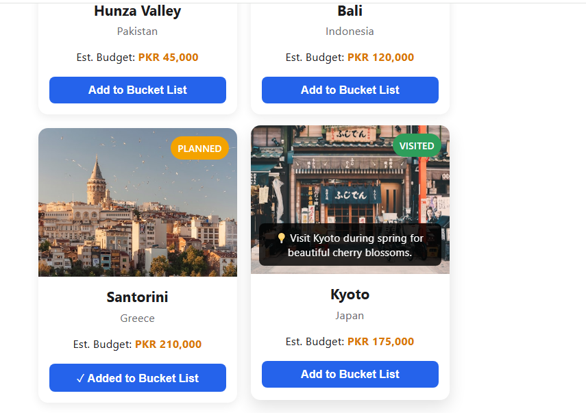
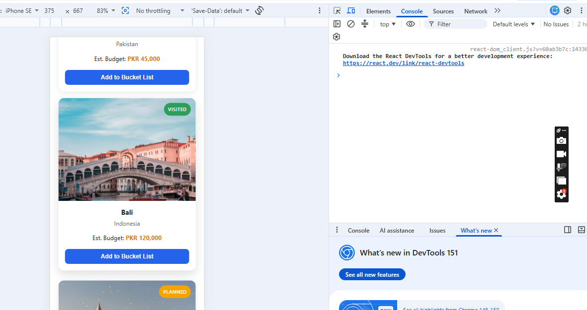

# WanderList – Day 22: Props & Event Handling

## Overview
Enhanced the `DestinationCard` component to make it interactive using React Props and Event Handling. Destination data (image, place name, country, budget, travel status, and travel notes) is now passed dynamically through props, with an "Add to Bucket List" feature and hover-based travel tips.

## Features
- Destination data displayed dynamically via props
- "Add to Bucket List" button with click event handling and visual feedback
- Hover effect showing a short travel note/tip
- Fully responsive design across screen sizes

## Screenshots

### Hover Effect – Travel Note





### Add to Bucket List – Clicked State





### Mobile View





## Tech Stack
- React
- CSS (custom, responsive with media queries)
- Vite

## How to Run
```bash
npm install
npm run dev

